# Block Types

## Provider Block
The provider block is used to extend Terraform's
functionality. It allows you to connect Terraform to any API-
driven platform, such as cloud platforms, SaaS applications,
on-premises hardware solutions, and more.
Provider blocks define where and what Terraform can
manage, such as AWS for cloud resources or GitHub for
repositories.

[Terraform Registry](https://registry.terraform.io/)

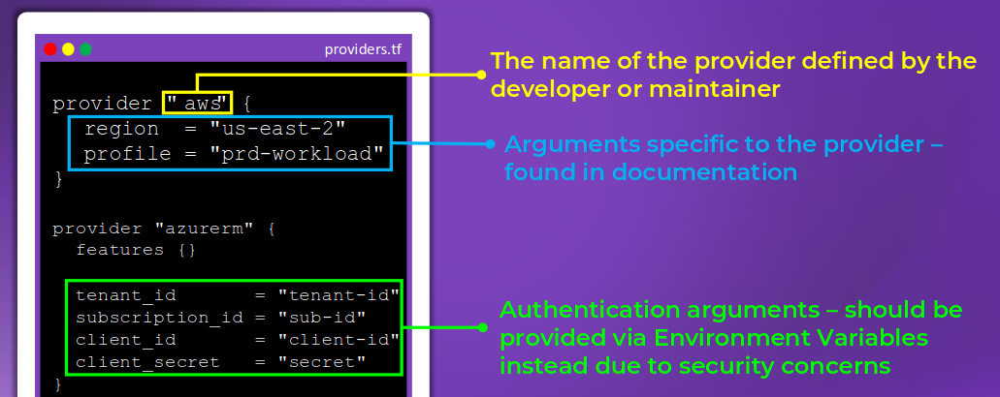

## Terraform Block

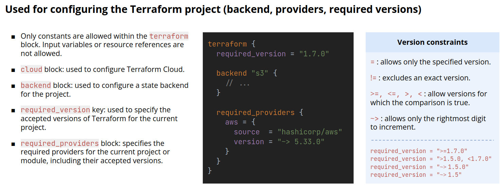

## Resource Block
The resource block is the core element in Terraform. It
defines the specific infrastructure pieces you want to create,
manage, or modify, such as virtual machines, databases, or
networks.
Resource blocks use a resource type (e.g., aws_instance) and
a unique name. It acts as a blueprint with the settings you
need to configure each resource.

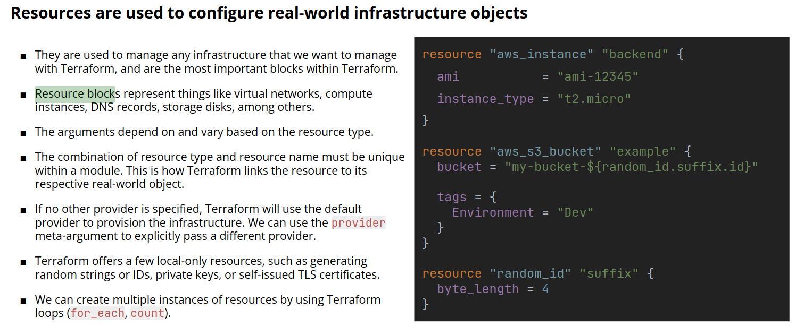

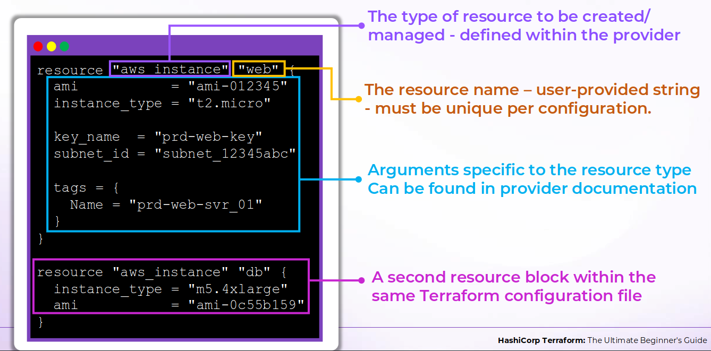

## Data Block
A data block retrieves information about existing resources or
external data without creating new infrastructure. It allows you
to dynamically reference attributes, such as the ID of an
existing subnet or the details of a Kubernetes cluster, making
configurations flexible and reusable.
By using data blocks, you can integrate Terraform with
resources managed outside of its configuration

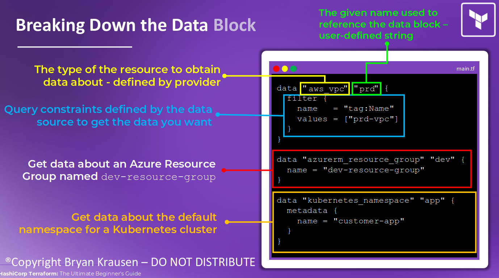

## Variable Block
A variable block is used to define inputs that can be reused
and customized, making your configurations more flexible
and dynamic. Variables allow you to parameterize values
instead of hardcoding them directly into resource blocks.
This approach improves reusability, simplifies managing
multiple environments, and helps maintain cleaner, more
maintainable configurations.

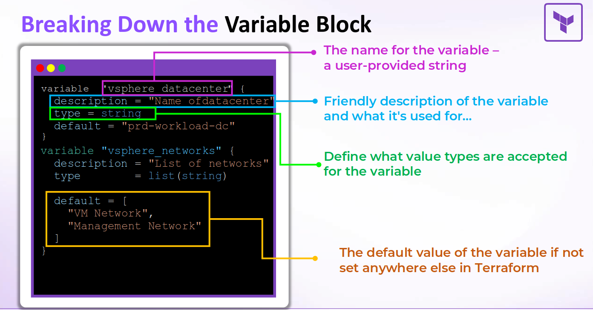

### Types of Variables
- Primitive variable types:
    - String
    - Number
    - Bool
- Complex Variable Types:
    - List
    - Map
    - Set

### Sources of variable values
- Environment Variables

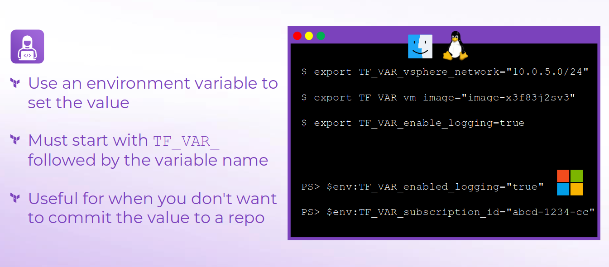

- tfvars File

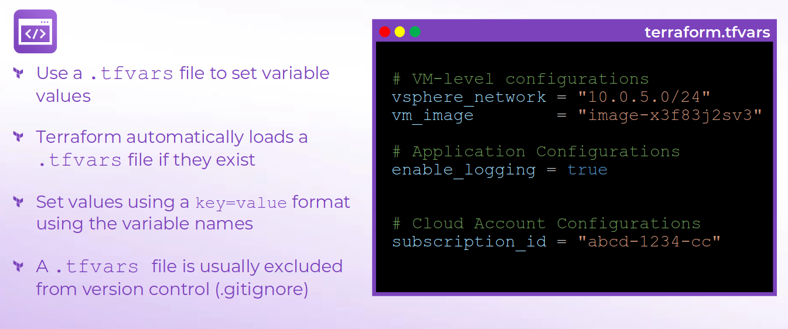

- CLI Flags

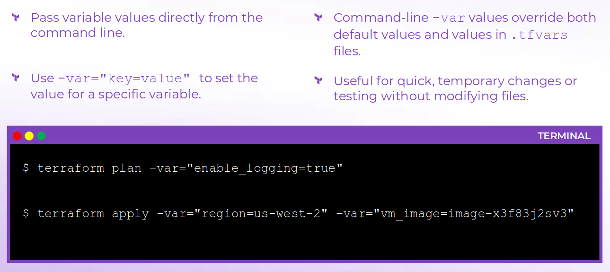

### Order of Precedence

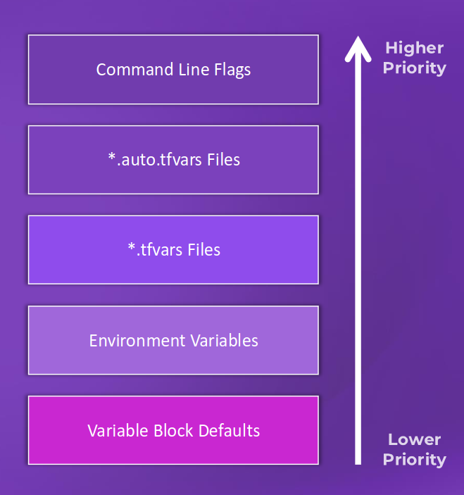

## Output Block
An output block in Terraform is used to display key
information about your infrastructure after a deployment,
such as IP addresses, DNS names, or resource IDs. Outputs
make it easy to retrieve and share important details without
manually looking them up in the cloud provider’s console.
They’re also useful for passing data between modules or
automating workflows.

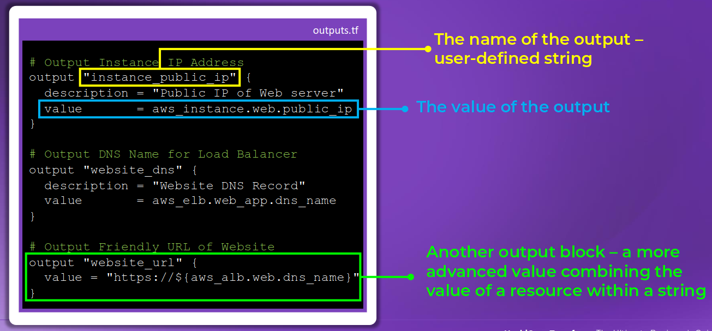

## Module Block
The module block allows you to reuse and organize Terraform
configurations by calling pre-defined modules, which will
simplify infrastructure management. Modules allow you to
group resources into reusable components, such as a network
or database module.

By passing variables to modules and using outputs, you can
integrate them into your configuration for more dynamic and
flexible deployments.

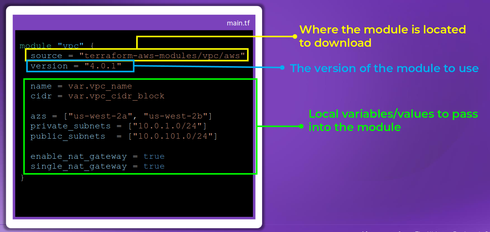

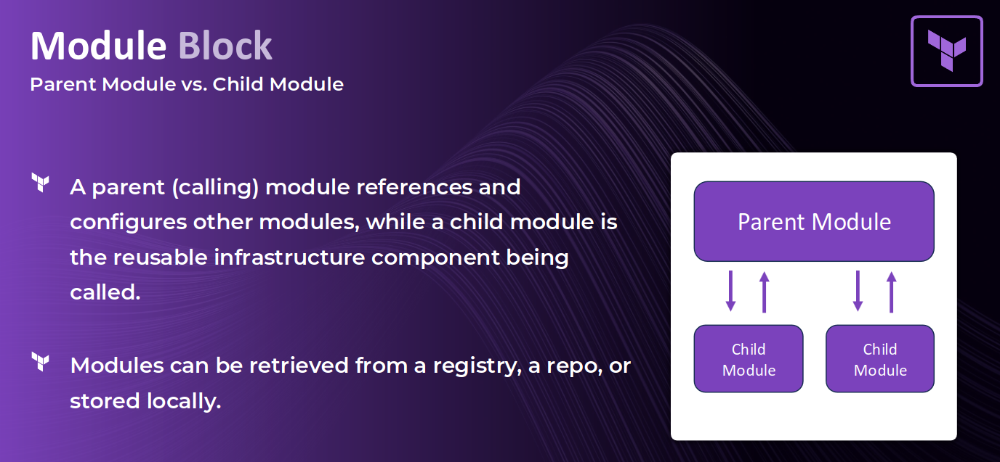

## Import Block
The import block in Terraform lets you bring existing
infrastructure under Terraform management by mapping
real-world resources to your configuration. This allows
Terraform to track and manage them without manual setup.

It simplifies migration, reduces effort, and ensures
infrastructure is versioned and controlled.

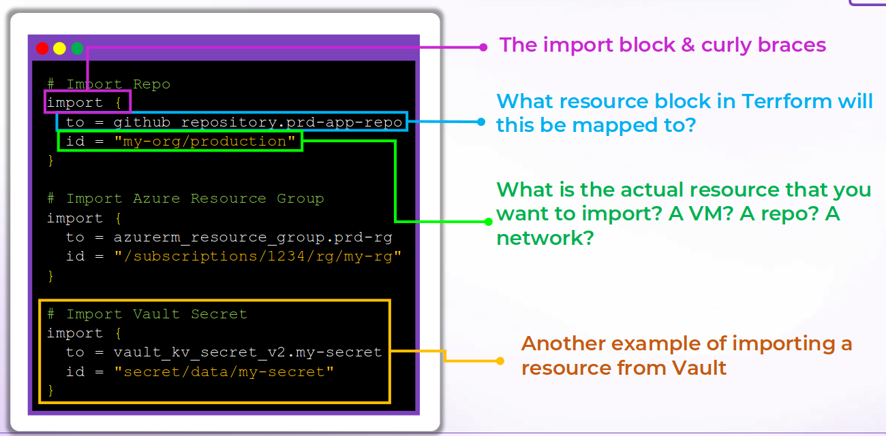
