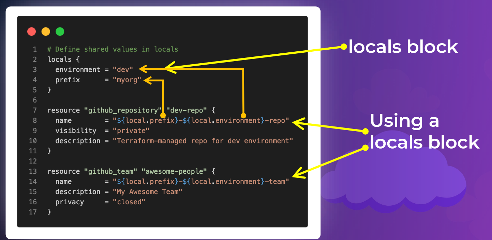

# Reusable Code

## Dynamic Code with Interpolation

## Locals to Avoid Code Duplication

## Meta-Arguments

## Built-In Functions

### Numeric Functions
- `max`
- `min`
### String Functions
- `join`
- `upper`
- `lower`
- `replace`
- `base64encode`

### Network Functions
- `cidrsubnet`

### Type Conversions
- `toset`
- `tolist`
- `tomap`
- `tostring`
